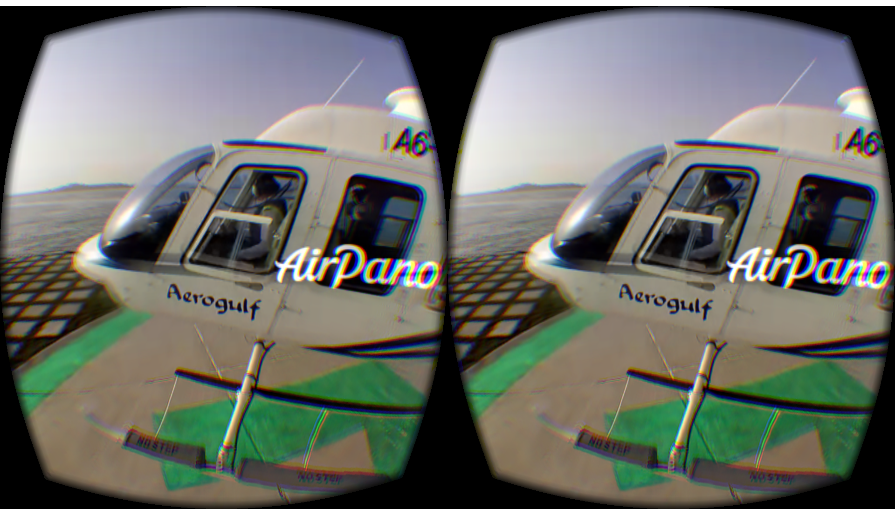

Bubble
======

Bubble is a panoramic rendering engine. It supports the rendering of
equirectangular, cylindrical, and panoramic textures. It can playback
spherical videos and render panoramic images. It also supports stacked
video produced from the VSN Mobile V.360 video camera. Bubble has support for
rendering multiple projections such as Stereoscopic (Oculus), Tiny Planet and
Fisheye.




## Status

Development

## Usage

```js
var Bubble = require('bubble');
var el = document.querySelector('#video');
var frame = new Frame(el, {src: '/path/to/video.mp4'});
```

## License

MIT
