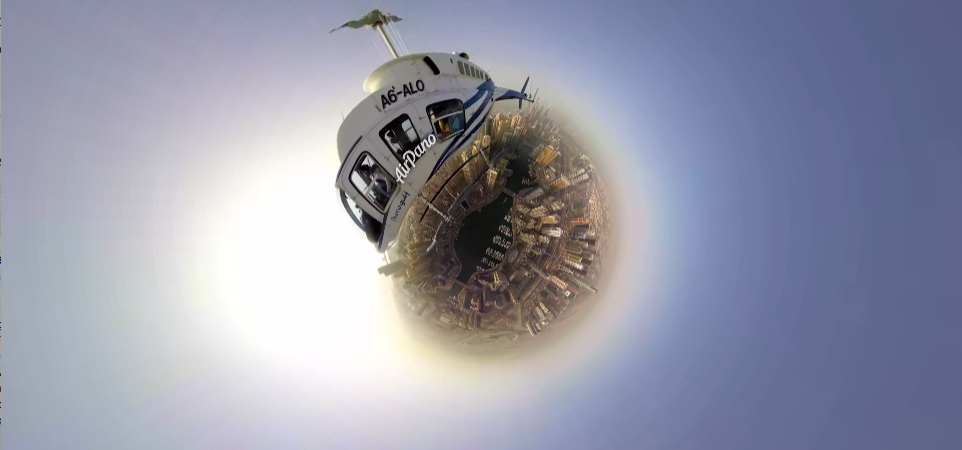

Bubble
======

Bubble is a 360 video rendering engine.



## Status

Development

## Usage

```js
var Bubble = require('bubble');
var el = document.querySelector('#video');
var frame = new Frame(el, {src: '/path/to/video.mp4'});
```

## License

MIT
