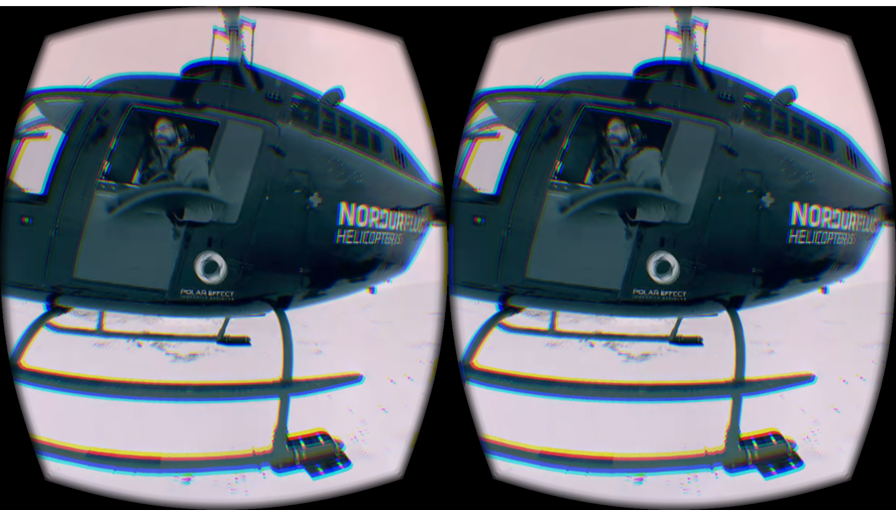

Axis
======

Axis is a panoramic rendering engine built for the Littlstar Player. It supports the rendering of
equirectangular, cylindrical, and panoramic textures. It can playback
spherical videos and render panoramic images. It also supports stacked
video produced from the VSN Mobile V.360 video camera. Axis has support for
rendering multiple projections such as Stereoscopic (Oculus), Tiny Planet and
Fisheye.

## Status

  Stable (DEPRECATED) - See [https://github.com/littlstar/axis3d](Axis3D)

## Installation

Axis can be built and installed in various ways.

### NPM

Axis is available through *npm*

```sh
$ npm install @littlstar/axis --save
```

### Source

Axis uses [browserify](http://browserify.org/) internally for installing and
building its dependency components.

```sh
$ git clone git@github.com:littlstar/axis.git
$ cd axis
$ make
```

Distribution builds are now available in the `dist/` directory.
Debug builds are now available in the `build/` directory.

## Example

For an interactive example, `make example` and navigate to http://localhost:9966/ in your browser =)

```js
const { createAxisFrame } = requre('@littlstar/axis')
const domElement = document.querySelector('#video');
const frame = createAxisFrame(domElement, {
  src: '/path/to/video.mp4'
});

frame.once('ready', () => {
  frame.seek(5)
  frame.play()
  frame.projection('tiny planet')
  frame.rotate('y', {
    value: 0.002,
    every: 500
  });
});
```

## TODO

* [ ] - Deprecate and start new project without THREE.js dependency.

## Screenshots

### Tiny planet projection


### WebVR support



### Littlstar web player

Axis is currently in use in production on the Littlstar web platform.


## License

MIT
